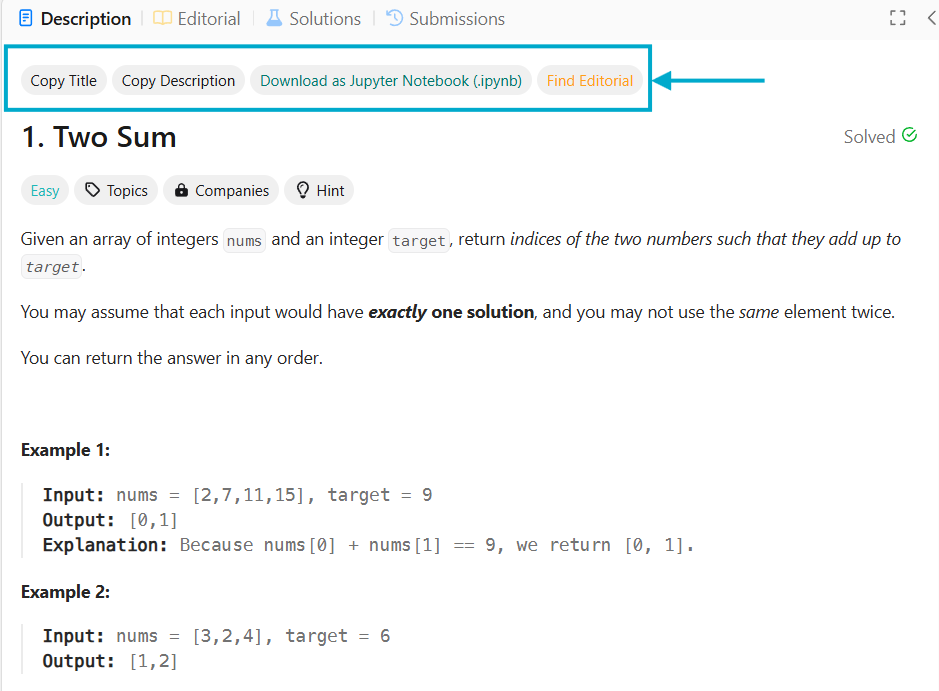
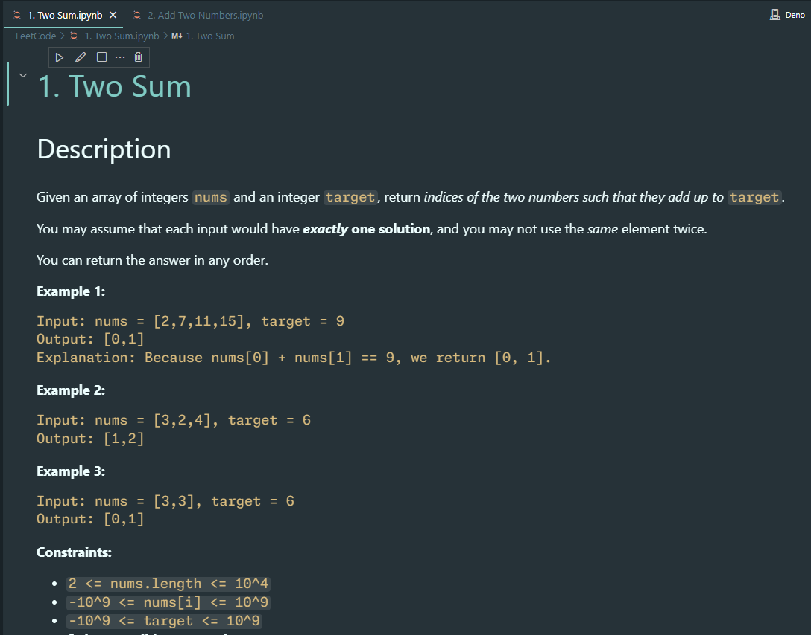
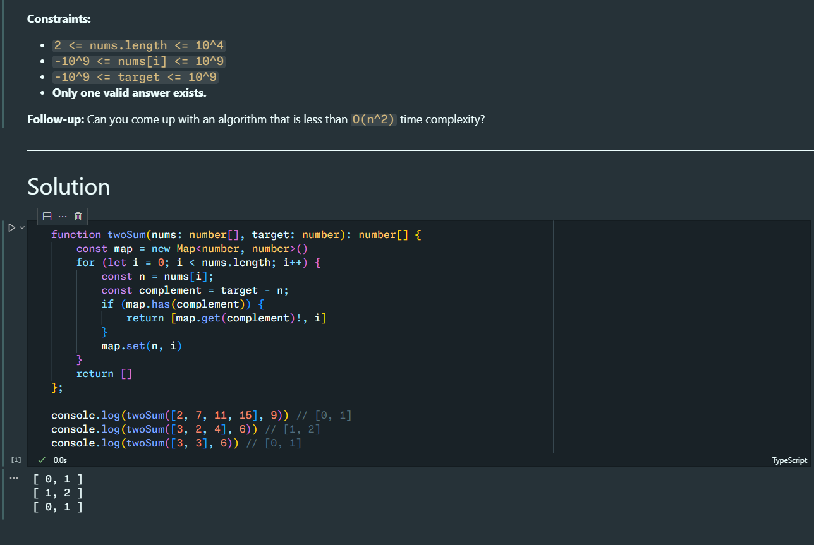

# LeetCode 工具箱 <!-- omit from toc -->

[English](/README.md) | **简体中文**

-   [特性](#特性)
-   [截图](#截图)
-   [关于 Jupyter Notebook](#关于-jupyter-notebook)
-   [安装](#安装)
-   [鸣谢](#鸣谢)
-   [许可](#许可)

## 特性

该用户脚本通过各种调整和添加增强了 LeetCode 问题页面。它既支持 [LeetCode 美国站](https://leetcode.com)，也支持 [力扣中国站](https://leetcode.cn)。

-   在问题描述的顶部，添加了这些按钮：
    -   **复制标题**
    -   **复制描述：** 以 Markdown 格式复制问题描述，方便粘贴到您的笔记或文档中。
    -   **下载为 Jupyter Notebook:** 将标题、描述（Markdown）和代码编辑器的当前内容捆绑到一个 `.ipynb` 文件中。
    -   **寻找官方题解 (\*)**：打开当前问题的官方题解截图，只要该截图存在于[Leetcode Screenshotter](https://github.com/akhilkammila/leetcode-screenshotter) repo 中。
-   便利功能：
    -   **保存时格式化代码：** 按下 <kbd>Ctrl + S</kbd> 时将自动格式化代码。
    -   **解锁 IntelliSense：** 享受自动补全、悬浮建议等功能，无需购买会员。
-   实验性：
    -   **下载官方题解(\*)**：可以在用户脚本管理器菜单（右键菜单或浏览器工具栏的扩展图标）下找到此命令。如果你能访问某篇官方题解，点击命令后题解会被保存为 `.md` 文件。此功能目前存在以下限制：
        -   题解中的代码将保存为 Leetcode Playground 的链接。
        -   数学表达式将显示为纯文本。
        -   视频将被跳过。

> (\*) 官方题解相关功能仅供美国站，因为中国站似乎并不需要会员就能查看官方题解。

## 截图

<table>
    <tr>
        <td>
            <figure>
                
                <figcaption>LeetCode 题目页面上新增的按钮</figcaption>
            </figure>
        </td>
        <td>
            <figure>
                
                <figcaption>代码编辑器里的 IntelliSense</figcaption>
            </figure>
        </td>
    </tr>
    <tr>
        <td>
            <figure>
                
                <figcaption>VS Code 中的 Notebook</figcaption>
            </figure>
        </td>
        <td>
            <figure>
                
                <figcaption>
                    你可以直接在笔记本中编写和运行代码
                </figcaption>
            </figure>
        </td>
    </tr>
</table>

## 关于 Jupyter Notebook

[Jupyter Notebook](https://jupyter-notebook.readthedocs.io/en/latest/)是一个开源 Web 应用程序，允许您创建和共享包含实时代码、公式、可视化和叙述文本的文档。

这个用户脚本可以帮助你将力扣题目转换成 Jupyter Notebook 文档，这样你就可以在本地机器上的同一处阅读题目、编写和运行解决方案、添加额外注释。

你可以使用诸如 [VS Code](https://code.visualstudio.com/docs/datascience/jupyter-notebooks) 之类的客户端打开`.ipynb` 笔记本。默认情况下，它支持 Python，但也提供[许多其他语言的内核](https://github.com/jupyter/jupyter/wiki/Jupyter-kernels)。

## 安装

要使用此用户脚本，您需要一个像 [Tampermonkey](https://www.tampermonkey.net/) 这样的用户脚本管理器（适用于 Chrome、Firefox 和其他浏览器）。

1. 为您的浏览器安装 Tampermonkey 或类似的用户脚本管理器。
2. 前往 [GreasyFork 页面](https://greasyfork.org/zh-CN/scripts/532158)，点击“安装此脚本”按钮。
3. 访问[一个 LeetCode 问题页面](https://leetcode.cn/problems/two-sum/)，您应该会看到此脚本添加的新功能。

## 鸣谢

此脚本受以下项目启发：

-   [Leetcode Screenshotter](https://github.com/akhilkammila/leetcode-screenshotter)
-   [LeetCode Problem to Markdown](https://greasyfork.org/en/scripts/448601)
-   [leetcode enhanced code editor](https://greasyfork.org/en/scripts/502740-leetcode-enhanced-code-editor)
-   [Leetcode: format on save](https://greasyfork.org/en/scripts/481927-leetcode-format-on-save)

## 许可

MIT 许可证
