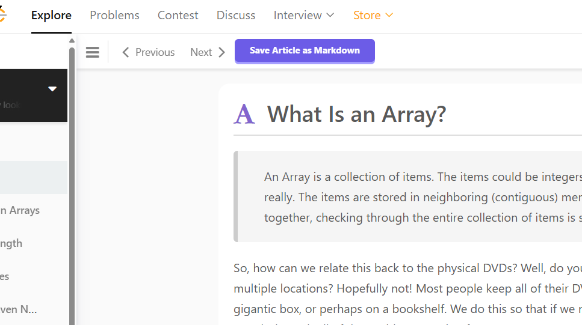

# LeetCode 工具箱 <!-- omit from toc -->

[English](/README.md) | **简体中文**

- [特性](#特性)
    - [问题页](#问题页)
    - [探索卡片](#探索卡片)
- [截图](#截图)
- [关于文章抓取](#关于文章抓取)
- [关于 Jupyter Notebook](#关于-jupyter-notebook)
- [安装](#安装)
- [鸣谢](#鸣谢)
- [许可](#许可)

## 特性

该用户脚本通过各种调整和添加增强了 LeetCode。它既支持 [LeetCode 美国站](https://leetcode.com)，也支持 [力扣中国站](https://leetcode.cn)。

### 问题页

- 在**描述**选项卡上，添加了以下按钮：

    - **复制标题：** 不知道为什么问题标题是一个不可点击的链接，没办法直接双击它来选择文本。此按钮会将标题复制到剪贴板。
    - **复制描述：** 以 Markdown 格式复制问题描述。非常适合粘贴到笔记中或咨询 AI 助手。
    - **保存为 Jupyter Notebook:** 将标题、描述（Markdown）和代码编辑器的当前内容捆绑到一个 `.ipynb` 文件中。更多详情，请参阅[关于 Jupyter Notebook](#关于-jupyter-notebook) 部分。

- 在**官方题解**选项卡上，添加了以下按钮：

    - **查找截图(\*)**：如果你无法访问某篇官方题解，点击此按钮尝试查找该题解的屏幕截图。如果找到，它将打开屏幕截图的链接。截图来源于 [Leetcode Screenshotter](https://github.com/akhilkammila/leetcode-screenshotter)。
    - **将官方题解保存为 Markdown(\*)**：如果你有权访问某篇官方题解，点击此按钮，脚本将抓取该并将其下载为一个 `.md` 文件。更多详情，请参阅[关于文章抓取](#关于文章抓取) 部分。

- **代码编辑器**的便利功能：
    - **保存时格式化代码：** 按下 <kbd>Ctrl + S</kbd> 时将自动格式化代码。
    - **解锁 IntelliSense：** 享受自动补全、悬浮建议等功能，无需购买会员。

### 探索卡片

- **将文章另存为 Markdown(\*)**：抓取并下载探索卡片文章为 Markdown 文件。更多详情，请参阅[关于文章抓取](#关于文章抓取)部分。

> (\*) 这些功能仅适用于美国站。

## 截图

<table>
    <tr>
        <td>
            <figure>
                
                <figcaption>复制问题标题和描述，或保存为 Jupyter Notebook</figcaption>
            </figure>
        </td>
        <td>
            <figure>
                
                <figcaption>查找官方题解截图，或保存为 Markdown</figcaption>
            </figure>
        </td>
        <td>
            <figure>
                
                <figcaption>把探索卡片文章保存为 Markdown</figcaption>
            </figure>
        </td>
    </tr>
    <tr>
        <td>
            <figure>
                
                <figcaption>代码编辑器中的 IntelliSense</figcaption>
            </figure>
        </td>
        <td>
            <figure>
                
                <figcaption>
                    通过VS Code，你可以直接在 Jupyter Notebook 中查看问题、编写和运行代码，同时添加额外注释
                </figcaption>
            </figure>
        </td>
    </tr>

</table>

## 关于文章抓取

LeetCode 编辑文章包含代码、幻灯片、视频、数学表达式等。你可以使用任何 Markdown 阅读器查看抓取的 `.md` 文件，但我开发了一个专门的 [LeetCode Editorial Reader](https://leetcode-editorial-reader.vercel.app/) 应用，以便以最佳布局查看它们。

需要注意以下几点：

- **代码**将保存为多个不同语言的代码块。[LeetCode Editorial Reader](https://leetcode-editorial-reader.vercel.app/) 可以将它们显示为选项卡布局。
- **幻灯片**将保存为一系列图像。[LeetCode Editorial Reader](https://leetcode-editorial-reader.vercel.app/) 可以将它们以真正的幻灯片布局展示。
- 说到图像，它们将保存为 Base64 编码的字符串，这意味着它们直接位于 Markdown 中，不会出现“找不到图像”的风险。 （但这也会使文件更大。）
- 数学表达式已保存，但你可能需要兼容的查看器，例如 VS Code 或 [LeetCode Editorial Reader](https://leetcode-editorial-reader.vercel.app/) 才能正确呈现它们。
- 视频**不会**被保存。

## 关于 Jupyter Notebook

[Jupyter Notebook](https://jupyter-notebook.readthedocs.io/en/latest/)是一个开源 Web 应用程序，允许你创建和共享包含实时代码、公式、可视化和叙述文本的文档。

“下载为 Jupyter Notebook” 功能可以帮助你将力扣题目转换成 Jupyter Notebook 文档，这样你就可以在本地机器上的同一处阅读题目、编写和运行解决方案、添加额外注释。

你可以使用诸如 [VS Code](https://code.visualstudio.com/docs/datascience/jupyter-notebooks) 之类的客户端打开`.ipynb` 笔记本。默认情况下，它支持 Python，但也提供[许多其他语言的内核](https://github.com/jupyter/jupyter/wiki/Jupyter-kernels)。

## 安装

要使用此用户脚本，你需要一个像 [Tampermonkey](https://www.tampermonkey.net/) 这样的用户脚本管理器（适用于 Chrome、Firefox 和其他浏览器）。

1. 为你的浏览器安装 Tampermonkey 或类似的用户脚本管理器。
2. 前往 [GreasyFork 页面](https://greasyfork.org/zh-CN/scripts/532158)，点击“安装此脚本”按钮。
3. 访问[一个 LeetCode 问题页面](https://leetcode.cn/problems/two-sum/)，你应该会看到此脚本添加的新功能。

## 鸣谢

此脚本受以下项目启发：

- [Leetcode Screenshotter](https://github.com/akhilkammila/leetcode-screenshotter)
- [LeetCode Problem to Markdown](https://greasyfork.org/en/scripts/448601)
- [leetcode enhanced code editor](https://greasyfork.org/en/scripts/502740-leetcode-enhanced-code-editor)
- [Leetcode: format on save](https://greasyfork.org/en/scripts/481927-leetcode-format-on-save)

## 许可

MIT 许可证
